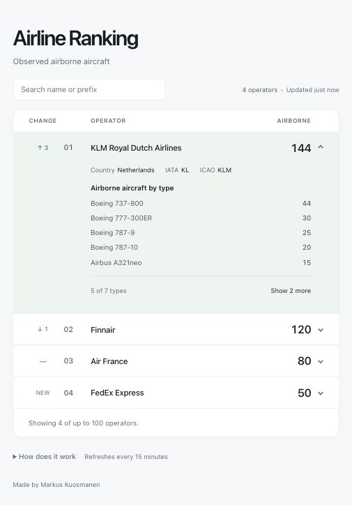

# Airline Ranking

An Angular leaderboard ranking all qualifying operators by observed airborne aircraft, built as a personal learning project.

Live app: [airlines.markuskuosmanen.com](https://airlines.markuskuosmanen.com/).

A TypeScript Lambda fetches a worldwide SkyLink snapshot every 15 minutes and publishes the ranking to S3. CloudFront serves the Angular app and cached ranking; rows animate when positions change. A Node.js backend provides the same ranking API for local development.



Preview uses synthetic data to illustrate rank indicators, operator metadata and the aircraft-type breakdown.

## Run locally

Requires Node.js 22.13+ (22.x) or 24.x. Checks and backend release packaging also require Python 3. GitHub Actions uses Node.js 22 and its runner includes Python 3.

```sh
npm ci
```

Create an untracked `.env` file in the project root:

```dotenv
SKYLINK_API_KEY=your-api-key
```

The local backend makes an immediate provider request on startup and polls every 15 minutes. Use one active poller per API key; stop the cloud schedule before starting a local backend with the same key.

Start the backend and frontend in separate terminals:

```sh
npm run backend
```

```sh
npm start
```

Open http://127.0.0.1:4200. Both services listen on loopback only. Angular proxies `/api/ranking` to the backend on port 3000; the API key stays on the backend.

## Ranking behavior

The leaderboard initially displays 100 rows. A single “Show 100 more” button reveals the next batch, shows progress and disappears once all matching rows are visible. Search filters the full current snapshot by operator name, ICAO code, IATA code or directory-listed country, ignoring case and surrounding spaces. The observed callsign prefix remains searchable when directory details are unavailable. Country searches refer to the operator’s listed country, not aircraft locations. Results keep their original leaderboard ranks and update with the cached snapshot. Changing the search resets the visible limit to 100. Loading more rows and searching make no additional requests. The result count and snapshot age share a compact line beside search on desktop and below the full-width search field on mobile.

The browser checks the cache every minute. The snapshot age sits above the table and updates on each browser check. The 15-minute refresh interval sits beside “How does it work” below the table; that disclosure contains the exact UTC timestamp and grouping rules. Column labels and any delay notice stay visible in the sticky table header while scrolling. Rows animate to their new positions; counts update immediately with a brief neutral highlight. Reduced-motion preferences disable these effects. If an update fails, the last successful ranking and its original timestamp remain visible with a delay notice. Before the first successful snapshot, the UI shows an unavailable message and retries automatically.

Click an airline to expand its aircraft-type breakdown; only one row is expanded at a time. Labeled Country, IATA and ICAO fields appear at the top of the drawer and close with it. Country flags use ADSBDB’s two-letter country ISO codes; emoji rendering varies by platform. Missing metadata fields show “Unavailable”. This is the country supplied by the airline directory, not the aircraft’s current location. Operators displayed as prefixes include a “Name unavailable” hint. Expanded rows use a pale green background; hovering a closed row uses neutral gray. The same cached snapshot supplies both the total and its breakdown, without extra provider requests. The expanded airline stays open when the ranking changes, and its total updates immediately with its breakdown. The breakdown initially shows the five most common types. Its footer shows the number of visible types, with “Show N more” revealing the remaining types and “Show fewer” returning to five. Opening an operator starts with five again; the current choice persists across snapshot updates while that operator stays open.

Rank indicators compare each operator's position with the previous successful, distinct snapshot: a green upward arrow with the number of places gained, a red downward arrow with the number of places lost, and “New” for an operator absent from the previous snapshot (including returning operators). A dash marks an unchanged rank (zero movement); a blank cell means no previous snapshot is available. Movement has its own column before the rank. Equal aircraft counts still use prefix order, so indicators reflect row position rather than count changes. Hover text explains the comparison period; screen-reader text describes the direction and number of places. The API represents this as `rankChange`: a signed integer (positive means up, zero means unchanged), `"new"`, or an omitted field when no comparison exists.

Comparison happens in the backend, so browser reloads and different viewers receive the same indicators. Repeated timestamps, name-only updates and failed fetches do not advance the comparison. After an outage, the next successful snapshot compares with the last successful one, even if the gap exceeds 15 minutes. The local backend holds comparison state in memory, so its first snapshot after a restart has no indicators. The scheduled Lambda handler persists the latest comparison in S3 across invocations. Neither mode stores a historical archive or adds provider calls for comparisons.

Aircraft types come from SkyLink's `aircraft_type` field. Common ICAO designators and a few exact model aliases are normalized using the [FAA type table](https://www.faa.gov/air_traffic/publications/atpubs/foa_html/appendix_3.html), with labels in `backend/aircraft-types.ts`. Exact canonical names match regardless of casing or whitespace. Specific Airbus model labels observed in the payload are checked against the [EASA model list](https://ad.easa.europa.eu/ad/2026-0064) and retain their model suffixes; they are not merged into broader types. Distinct variants remain separate. Unrecognized labels retain the provider wording with normalized whitespace and capitalization; missing or invalid values become “Unknown type”. Metadata can be incomplete or incorrect, and unfamiliar aliases may remain separate. Breakdown counts always sum to the airline total.

One continuously running local backend makes approximately 96 aircraft-snapshot requests per day. Every local backend restart adds an immediate request; opening more browser tabs does not trigger more provider requests. Failed requests are retried at the next scheduled refresh.

## Checks

Run `npm run check` before committing. GitHub Actions runs the same command on pull requests and pushes to `main`.

| Command | Purpose |
| --- | --- |
| `npm run check` | Run linting, backend/infra type checking, tests, the production build, and strict CDK synthesis |
| `npm run lint` | Check strict TypeScript rules, Angular conventions, and template accessibility |
| `npm run lint:fix` | Apply automatic lint fixes |
| `npm run typecheck:backend` | Type-check the backend and shared ranking types |
| `npm test` | Test ranking, caching, provider cost controls, HTTP behavior, scheduled refreshes, infrastructure and release safeguards |
| `npm run build` | Build the frontend into `dist/airline-ranking/browser` |
| `npm run typecheck:infra` | Type-check the CDK application |
| `npm run infra:synth` | Bundle Lambda and validate the generated CloudFormation template without AWS lookups |
| `npm run infra:diff` | Compare the stack with deployed resources |
| `npm run infra:deploy` | Deploy the stack after reviewing its diff |
| `npm run infra:publish -- cdk.out/outputs.json` | Upload the frontend and wait for CloudFront cache invalidation |
| `npm run infra:release -- BUCKET DISTRIBUTION FUNCTION_ARN` | Update the existing Lambda code and publish the frontend; requires Python 3 for ZIP packaging |

Tests use Node's built-in test runner and synthetic data. They do not require an API key or contact either provider. Lint warnings fail the check. Drawer layout, responsive spacing and animations are checked manually in the browser; the unit tests do not verify their appearance.

## Scope

The local backend uses Node's built-in HTTP server and fetch API, holding the latest ranking in memory and persisting operator details and lookup cost controls in an untracked JSON cache. In AWS, Lambda persists these in S3. CDK defines the infrastructure in `infra/`; an AWS-native pipeline deploys application changes from `main`.

Aircraft are deduplicated by ICAO24, keeping the newest observation (ground wins equal-time conflicts). We count only explicitly airborne aircraft observed within five minutes of the snapshot. Callsigns must contain three letters followed by one to four letters or digits. Callsigns matching the aircraft registration after removing spaces and hyphens are excluded. Malformed, incomplete, or outdated global snapshots are rejected.

Every qualifying prefix is counted, including cargo and regional operators. All qualifying operators are ranked by count, with prefix order breaking ties. Separate prefixes are not combined under a brand. The format check is a heuristic, not proof of operator identity. These are observed counts, dependent on SkyLink coverage, not worldwide fleet totals.

## Operator details and lookup costs

Names, countries, IATA codes and ICAO codes come exclusively from [ADSBDB's airline endpoint](https://www.adsbdb.com/#get_route_airline), queried by the observed three-letter prefix for operators in the snapshot. Returned ICAO codes must match the prefix. Duplicate records must agree on a name; conflicting names remain unavailable. Missing or conflicting countries and IATA codes remain unavailable independently. IATA codes can contain digits and some operators have no IATA code. No SkyLink directory requests or metadata fallback are used. The observed prefix still controls grouping and tie-breaking; a directory match does not prove every callsign belongs to that operator.

The backend publishes the ranking before directory lookups complete. Unresolved operators display their observed prefixes and unavailable metadata. Browsers receive resolved details on their next normal poll. Directory-only updates keep the snapshot timestamp and do not trigger movement or count highlights.

`.cache/operator-names.json` is excluded from Git. AWS uses the same structure in the private `operator-names.json` state object:

```json
{
  "source": "adsbdb",
  "names": {
    "FIN": { "name": "Finnair", "country": "Finland", "countryIso": "FI", "iata": "AY", "icao": "FIN", "checkedAt": "2026-10-07T12:00:00.000Z" }
  },
  "attempts": [1791374400000],
  "cooldownUntil": 0
}
```

The source marker separates ADSBDB metadata and its budget from the old SkyLink cache. On first load of a valid legacy cache, migration discards its labels and archives its paid `attempts` and `cooldownUntil` under `legacySkylink`. The new ADSBDB cache starts empty and the migration is persisted before provider requests. It happens once and retains the original state file and conditional S3 write protections; no additional storage resource is needed. Failed migrations disable requests. Do not delete state files to refresh metadata or reset quotas.

Existing ADSBDB cache entries without `countryIso` remain valid and are eligible for a one-time refresh during scheduled directory enrichment. The existing per-refresh and rolling request limits still apply. Entries with unavailable ISO codes retain their normal expiry interval.

`checkedAt` uses ISO timestamps; `attempts` and `cooldownUntil` use Unix milliseconds. Constants in `backend/operator-directory.ts` enforce:

| ADSBDB control | Value |
| --- | --- |
| Known record refresh | 30 days |
| Missing or ambiguous record refresh | 7 days |
| Cooldown after a failed lookup | 24 hours |
| Maximum lookup attempts | 5,000 per rolling 32 days |
| Maximum attempts per refresh | 100 |
| Minimum spacing between requests | 1 second |

These are application guardrails, not purchased allowances. ADSBDB's [published rate limits](https://www.adsbdb.com/) currently block clients at 512+ requests within 60 seconds for 60 seconds, and at 1,024+ for 300 seconds. Its implementation limits by IP. Our sequential, paced lookups stay below these thresholds, but shared outgoing IPs or provider policy changes can still cause throttling. No monthly allowance or availability guarantee was found. The public API's software is MIT-licensed; an explicit separate licence for caching and displaying airline records has not been confirmed. The site's copying restriction explicitly refers to flight-route data, which this application does not fetch.

Expiry is checked only during snapshot refreshes for operators in the current snapshot. Every attempt is persisted before contacting ADSBDB, with a provisional cooldown to prevent immediate retries after crashes. Successful responses clear the cooldown. HTTP 404, empty results and ambiguous names are completed negative lookups; malformed responses, HTTP 429, server errors and timeouts stop the batch and retain previous ADSBDB data. Missing optional fields do not shorten a known record's TTL. No immediate retries or paid fallback occur. Lookup pacing survives restarts; the Lambda deadline can stop a batch before the batch limit, and remaining prefixes are checked on subsequent scheduled refreshes. Operators without cached details remain visible as prefixes while bounded batches populate their details over subsequent refreshes. Reads and searches never trigger provider calls.

Local writes replace the cache via a temporary file and rename. Unreadable or invalid caches and failed writes disable lookups. The local cache requires a single backend process; sharing it between concurrent local processes is unsupported. Lambda uses conditional S3 writes to reject conflicting updates. Cached provider output remains outside the public repository.

SkyLink is used only for airborne snapshots. A single continuously running poller needs 2,976 requests in 31 days (3,072 in 32 days). Production reserves each 15-minute slot before fetching, with no automatic request retries, and persists a separate maximum of **3,100 snapshot attempts per rolling 32 days** in `refresh-state.json`. Failed requests consume their reservation. Reaching the cap stops paid snapshot fetches until attempts expire; the last published snapshot remains available and becomes stale. Storage failures prevent unreserved requests.

Older scheduled state records only the last attempted slot. Migration conservatively seeds snapshot history as if every slot in the preceding 32-day window through that slot was attempted, rather than granting a fresh budget. New installations with a null last slot start with empty history. Redeployments retain this history. Historical SkyLink directory attempts remain archived separately and still count toward provider billing during the transition. These guards apply to this production poller, **not the entire SkyLink subscription**: local backend startup and polling, manual tests, other instances and external usage are additional. SkyLink's [direct-subscription terms](https://skylinkapi.com/terms/) permit billed overage; monitor usage and any provider-side spending controls.

## Scheduled Lambda handler

`backend/lambda.ts` runs one refresh per invocation and publishes the ranking as `api/ranking` in a private website bucket. The frontend can read this object through CloudFront without a separate HTTP backend. The browser derives staleness from the original snapshot timestamp (15 minutes plus 30 seconds), so a stopped job still produces a delay notice.

The CDK stack packages the handler and defines its permissions and schedule. All Regional resources use the selected AWS Region, `eu-north-1`.

The handler requires:

| Setting | Purpose |
| --- | --- |
| `STATE_BUCKET` | Private bucket containing operator cache and refresh state |
| `WEBSITE_BUCKET` | Private bucket receiving the published ranking |
| `SKYLINK_KEY_PARAMETER` | SSM SecureString parameter name containing the API key |

The scheduler must supply `scheduledAt` as its original scheduled UTC timestamp, run every 15 minutes, and use a single concurrent Lambda invocation. Events older than 15 minutes are rejected. A persistent slot reservation is written before fetching SkyLink; duplicate deliveries or restarts in that slot cannot repeat the paid snapshot call. Failed attempts wait until the next slot. A retry can republish the saved ranking without another provider request.

Before enabling the schedule, initialize `refresh-state.json` with `{"lastAttemptSlot":null,"snapshot":null,"snapshotAttempts":[]}` only for a new poller, and preserve the existing `operator-names.json` cache. Its provider migration runs automatically on first load, preserving paid lookup history while discarding old labels. Missing, unreadable or invalid cloud state blocks polling rather than silently resetting these controls. State writes require the S3 version just read; a conflicting writer stops without making its reserved provider call.

The latest snapshot and its rank changes survive restarts. The ranking is published before lookups and again after enrichment. Lookups stop when execution time is running low and continue on a later scheduled refresh; the existing TTL, rolling cap and failure cooldown still apply. SDK retries are disabled, and provider requests retain their timeouts (15 seconds for snapshots, ten seconds for directory lookups). A failed publication leaves the last published object available; a later invocation can recover it from saved state.

Lambda errors identify a fixed failure stage: configuration, API key retrieval, operator cache loading, snapshot fetching, ranking publication, or the remaining refresh processing. Raw error messages, provider responses and credentials are not included.

Use one active poller per API key. Stop the local backend when enabling the cloud schedule: local and S3 budgets are separate and cannot enforce an account-wide cap. Do not delete or replace cloud state as a refresh mechanism. Confirm AWS spending protection before deployment; application request controls do not cap AWS charges.

## AWS infrastructure

`infra/stack.ts` defines one stack: two private S3 buckets, CloudFront with Origin Access Control, an ARM64 Node.js 22 Lambda, a 15-minute EventBridge Scheduler schedule, and an email alarm for Lambda errors. The frontend and `api/ranking` share one CloudFront origin; browser traffic does not invoke Lambda or SkyLink. No API Gateway, VPC or NAT gateway is required.

The public address is `https://airlines.markuskuosmanen.com`. The stack creates an A alias pointing to the existing distribution in the supplied public hosted zone; it does not create another zone or register the domain. It uses a separately issued, non-exportable ACM certificate in `us-east-1`, as required for global CloudFront HTTPS. Application resources stay in Stockholm. The original CloudFront address remains available as `WebsiteUrl`; `CustomDomainUrl` supplies the custom address.

Before deploying, finish domain registration and verify any registrant email AWS requests. Add the certificate's DNS validation CNAME to the domain's hosted zone and wait for ACM to show **Issued**. Keep that CNAME for managed renewal. Supply `CertificateArn` and `HostedZoneId` during the first domain deployment; subsequent deployments reuse the existing parameter values. Domain registration, certificate and zone are managed separately from the application stack.

Polling is **disabled by default**. Lambda has one reserved concurrent execution, a two-minute timeout and no automatic retries; Scheduler retries are also disabled. Logs expire after seven days. The state bucket retains its current objects and seven days of superseded versions. Both buckets survive stack removal, and termination protection is enabled. Retained resources continue to incur storage charges; review them explicitly when retiring the application. Version history is for recovery, not for resetting the lookup budget.

CloudFront honors each object's cache headers, with a 30-second default and no minimum TTL. The ranking expires after 30 seconds; missing objects return an error instead of the Angular page. Only `/` is an application route. The alarm covers Lambda execution errors, not every possible scheduling or delivery failure; also check snapshot freshness after enabling polling.

### First deployment

Local synthesis and tests need no AWS credentials and make no provider calls. Before deploying:

1. Confirm the selected Region (`eu-north-1`), **Paid Plan** and monthly project spend limit in AWS Settings. The project uses a $20 monthly limit that pauses it when reached; budget notifications alone are not a spending cap. Domain registration and renewal are separate costs, and AWS credits do not cover them. Do not upgrade or activate advanced features as part of deployment.
2. Confirm the Lambda concurrency quota permits reserving one execution while maintaining AWS's required unreserved capacity. Do not remove the concurrency limit to work around a quota error.
3. Authenticate the named `personal` AWS profile. Bootstrap CDK in this project and Region if necessary, then synthesize and review the diff:

   ```sh
   npx cdk bootstrap aws://PROJECT_ACCOUNT_ID/eu-north-1 --profile personal
   npm run infra:synth
   npm run infra:diff -- AirlineRanking --profile personal
   npm run infra:deploy -- AirlineRanking --profile personal --parameters AlertEmail=YOUR_EMAIL --parameters CertificateArn=YOUR_CERTIFICATE_ARN --parameters HostedZoneId=YOUR_ZONE_ID --outputs-file cdk.out/outputs.json
   ```

   Replace the placeholders locally; keep credentials and deployment outputs out of Git. Review resource and IAM changes before approving deployment. Confirm the SNS subscription email to receive refresh failure alerts. This first deployment leaves polling disabled.
4. Create the standard-tier SSM **SecureString** `/airline-ranking/skylink-api-key` in Stockholm, using the default AWS-managed SSM key. Enter the API key directly in the AWS console. The stack references this parameter without storing its value in CloudFormation or the frontend.
5. Stop the local backend. Upload its existing `.cache/operator-names.json` to `operator-names.json` in the stack's private `StateBucket`, preserving `attempts` and `cooldownUntil`. Initialize `refresh-state.json` there with `{"lastAttemptSlot":null,"snapshot":null,"snapshotAttempts":[]}` only on the first deployment. Never overwrite existing cloud state during a redeployment.
6. Build and publish the frontend using the stack outputs:

   ```sh
   npm run build
   AWS_PROFILE=personal npm run infra:publish -- cdk.out/outputs.json
   ```

   Publishing uploads assets before `index.html`, requires revalidation for HTML and unhashed files, and gives hashed JavaScript/CSS a one-year cache lifetime. It waits for CloudFront invalidation to complete. Only the current build's HTML, JavaScript and CSS files are accepted; unexpected directories, files or symlinks stop publication before AWS requests. The script never reads or writes backend state or `api/ranking`, and does not delete previous frontend assets. Old hashed files remain available to visitors with an older page; review them when retiring the site. If an upload fails before HTML is published, the existing page remains available. A later invalidation failure can leave some visitors seeing cached files until expiry; rerun publishing to retry.
7. Once state, key, plan and spend-limit verification and frontend are ready, review and deploy with `-c isPollingEnabled=true`:

   ```sh
   npm run infra:diff -- AirlineRanking --profile personal -c isPollingEnabled=true
   npm run infra:deploy -- AirlineRanking --profile personal -c isPollingEnabled=true --parameters AlertEmail=YOUR_EMAIL
   ```

   Keep this context value explicit on subsequent deployments; omitting it disables polling. To pause polling, deploy with `-c isPollingEnabled=false`. Pausing does not stop CloudFront or storage charges. Keep the local backend stopped while the cloud poller is active.
8. Open the output `CustomDomainUrl` and verify a fresh ranking after the next scheduled invocation. `WebsiteUrl` provides the original CloudFront address. Check the Lambda logs and confirm the state objects advance without losing quota history. An empty site before the first successful refresh is expected.

### Automatic deployment from main

GitHub Actions checks pull requests and `main` using `npm run check`. `infra/deployment-stack.ts` defines a separate `AirlineRankingDeployment` stack: CodePipeline V2 fetches `main` through CodeConnections and runs one CodeBuild job. The job installs dependencies, runs the checks, and releases application code. Executions queue, with one build at a time and a 30-minute build timeout. The project has upgraded to Paid, which cannot be reversed, so releases do not check the plan. Confirm the spend limit separately in AWS Settings before infrastructure changes.

`infra/release.ts` bundles the backend with esbuild and creates a ZIP using Python 3's standard library, included in the CodeBuild image. It verifies the existing Lambda's Node.js 22 runtime, ARM64 architecture and handler, updates code with an optimistic revision guard, waits for completion, and verifies the deployed package hash before publishing the frontend. It never invokes Lambda or calls SkyLink. A failure stops the release; backend and frontend updates are sequential, not an atomic transaction. If frontend publication fails, the updated backend remains deployed.

Create a GitHub CodeConnections connection in Stockholm. Install AWS Connector for GitHub with access to **only this repository**, then select that installation in the connection's **App Installation** field. Authorizing the app as a GitHub user is a separate step and does not replace repository installation. Connections created through an API remain pending until setup is completed in the console. See [AWS's GitHub connection setup](https://docs.aws.amazon.com/codepipeline/latest/userguide/connections-github.html). No GitHub personal access token or permanent AWS key is needed.

After the application stack exists and the release code has been merged into `main`, review and deploy the pipeline:

```sh
npm run infra:diff -- AirlineRankingDeployment --exclusively --profile personal
npm run infra:deploy -- AirlineRankingDeployment --exclusively --profile personal --parameters ConnectionArn=YOUR_CONNECTION_ARN
```

The pipeline can start immediately after creation. Verify automatic change detection after the next approved merge to `main`: the execution history must show a repository event trigger and the merged commit ID. A successful manually started release does not verify this trigger. Automatic releases preserve the deployed schedule, concurrency, environment and IAM permissions. Polling is controlled only by reviewed manual deployments of the application stack with an explicit `-c isPollingEnabled` value. A synthesized template in CI is validation, not an infrastructure deployment.

Infrastructure remains defined in CDK. Changes to either stack require a reviewed manual deployment; the pipeline cannot assume CDK bootstrap roles, deploy CloudFormation, manage IAM, change scheduling or upgrade the AWS plan. Its application permissions cover code updates and configuration reads for the existing refresh Lambda, frontend HTML/JavaScript/CSS uploads, and invalidation of the existing distribution. Artifact and log access is limited to its own resources. Connection policies constrain repository and branch requests to this repository's `main` branch.

Direct Lambda code releases do not update CloudFormation's recorded code asset. Before a manual infrastructure deployment, check out the latest approved `main`, run the checks and review `cdk diff`; CDK bundles that revision's backend and may update Lambda code again. Do not deploy an older checkout unless intentionally rolling back. Keep polling context explicit. Bootstrap administrator permissions remain available for manual infrastructure administration, but are not reachable through pipeline roles.

Code merged into `main` is still trusted application code: replacement Lambda code can use the existing runtime role to access the SkyLink key and state. Restricting deployment authority does not protect provider quota from malicious backend code; protect repository access and retain provider-side controls. The build has no direct permission to read that key or write polling state or `api/ranking`.

Build logs and source artifacts expire after seven days. The artifact bucket survives stack removal. CodeBuild, pipeline executions and artifact storage incur usage even when checks fail or infrastructure is unchanged; the build timeout bounds one run, not monthly usage. No deployment step upgrades the plan or changes the spend limit.

To pause deployment, disable the pipeline's inbound transition to its Deploy stage in AWS. To recover an application release, revert the relevant change through a PR and release again; automatic releases do not use CloudFormation rollback. Manual infrastructure updates retain CloudFormation's normal rollback behavior. Verify the website and snapshot freshness after a release.

### Releases

Deployments continue from `main`. Releases mark meaningful milestones rather than every merged PR. After the owner approves a release, confirm the deployment of its exact commit succeeded and verify the live website and ranking endpoint. If the release includes infrastructure changes, complete and verify their manual deployment too.

Create an annotated Git tag such as `v0.1.0` on that verified commit and publish a GitHub release with concise notes describing the changes and any known limitations. Never move or reuse a published tag. While the application is in the `0.x` stage, increment the patch number for fixes (`v0.1.1`) and the minor number for substantial features (`v0.2.0`). Match `package.json` to the planned release version through a PR before deploying and tagging it.

Tags do not trigger deployments or restore infrastructure, cached data or provider quota history. Recover application changes through the revert-and-release procedure above. No release branch or separate changelog is required.

### Retiring the application

Disabling polling stops scheduled provider requests, but leaves the website and AWS resources running. To retire the application completely:

1. Disable the schedule and stop any local backend using the same API key. Preserve any state needed for recovery; keep exported caches outside Git.
2. Delete `AirlineRankingDeployment` first, then disable termination protection and delete the `AirlineRanking` stack. The pipeline imports application resource identifiers, so its stack must be removed first. Empty and delete its retained artifact bucket when no longer needed. Both S3 buckets are retained and continue to incur storage charges.
3. After confirming their data is no longer needed, empty and delete the retained buckets. The versioned state bucket must also have all object versions and delete markers removed. Its seven-day lifecycle rule removes superseded versions, not current objects.
4. Delete the separately created `/airline-ranking/skylink-api-key` parameter if it is no longer needed. Review any separately configured billing alerts or deployment access.
5. Review the `CDKToolkit` bootstrap stack and its assets separately. Bootstrap resources support CDK deployments in the AWS project and Region and may be shared by other applications; remove them only when no remaining deployment needs them.
6. The domain, hosted zone and certificate are not deleted with the stack. Keep them if other sites use them. Otherwise, review domain auto-renewal and remove unneeded DNS storage and certificates; do not remove validation records for certificates still in use. Domain renewal and hosted-zone charges continue while retained.
7. Check billing after usage records have updated and confirm no unwanted resources remain. Retiring AWS resources does not cancel the SkyLink subscription; review that separately.

Development follows the lightweight branch, pull request, and squash-merge workflow in [AGENTS.md](AGENTS.md).
