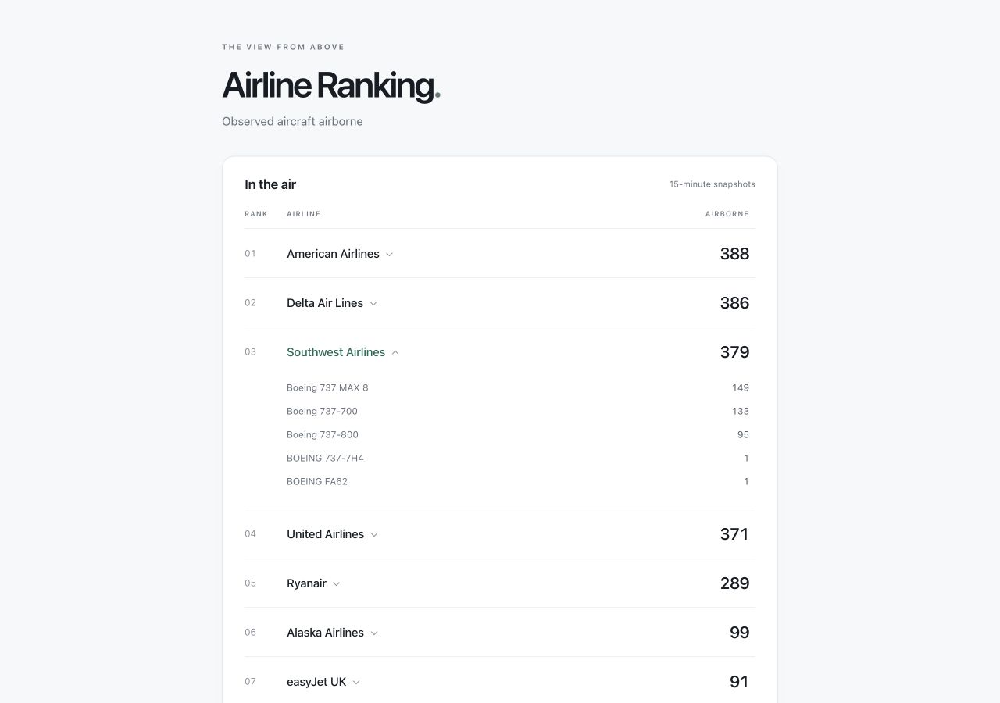

# Airline Ranking

A minimalist Angular leaderboard showing observed airborne aircraft for the top 100 observed operators, built as a personal learning project.

The local TypeScript backend fetches a worldwide SkyLink snapshot on startup and every 15 minutes. The UI reads the cached ranking and animates changes when a new snapshot arrives.



Preview uses synthetic data to illustrate rank indicators, operator country and the aircraft-type breakdown.

## Run locally

Requires Node.js 22.13+ (22.x) or 24.x. Checks and backend release packaging also require Python 3. GitHub Actions uses Node.js 22 and its runner includes Python 3.

```sh
npm ci
```

Create an untracked `.env` file in the project root:

```dotenv
SKYLINK_API_KEY=your-api-key
```

Start the backend and frontend in separate terminals:

```sh
npm run backend
```

```sh
npm start
```

Open http://127.0.0.1:4200. Both services listen on loopback only. Angular proxies `/api/ranking` to the backend on port 3000; the API key stays on the backend.

The browser checks the cache every minute. The snapshot age sits above the table and updates on each browser check. The 15-minute refresh interval sits beside “How does it work” below the table; that disclosure contains the exact UTC timestamp and grouping rules. Column labels and any delay notice stay visible in the sticky table header while scrolling. Rows animate to their new positions; counts update immediately with a brief neutral highlight. Reduced-motion preferences disable these effects. If an update fails, the last successful ranking and its original timestamp remain visible with a delay notice. Before the first successful snapshot, the UI shows an unavailable message and retries automatically.

Click an airline to expand its aircraft-type breakdown; only one row is expanded at a time. When available, the operator’s country appears at the top of the drawer and closes with it. This is the country supplied by the airline directory, not the aircraft’s current location. Expanded rows use a pale green background; hovering a closed row uses neutral gray. The same cached snapshot supplies both the total and its breakdown, without extra provider requests. The expanded airline stays open when the ranking changes, and its total updates immediately with its breakdown. The breakdown initially shows the five most common types, with “Show more” revealing the remaining types and “Show less” returning to five. Opening an operator starts with five again; the current choice persists across snapshot updates while that operator stays open.

Rank indicators compare each operator's position with the previous successful, distinct snapshot: a green upward arrow with the number of places gained, a red downward arrow with the number of places lost, and “New” for an operator absent from the previous top 100 (including returning operators). A dash marks an unchanged rank (zero movement); a blank cell means no previous snapshot is available. Movement has its own column before the rank. Equal aircraft counts still use prefix order, so indicators reflect row position rather than count changes. Hover text explains the comparison period; screen-reader text describes the direction and number of places. The API represents this as `rankChange`: a signed integer (positive means up, zero means unchanged), `"new"`, or an omitted field when no comparison exists.

Comparison happens in the backend, so browser reloads and different viewers receive the same indicators. Repeated timestamps, name-only updates and failed fetches do not advance the comparison. After an outage, the next successful snapshot compares with the last successful one, even if the gap exceeds 15 minutes. The local backend holds comparison state in memory, so its first snapshot after a restart has no indicators. The scheduled Lambda handler persists the latest comparison in S3 across invocations. Neither mode stores a historical archive or adds provider calls for comparisons.

Aircraft types come from SkyLink's `aircraft_type` field. Common ICAO designators and a few exact model aliases are normalized using the [FAA type table](https://www.faa.gov/air_traffic/publications/atpubs/foa_html/appendix_3.html), with labels in `backend/aircraft-types.ts`. Exact canonical names match regardless of casing or whitespace. Specific Airbus model labels observed in the payload are checked against the [EASA model list](https://ad.easa.europa.eu/ad/2026-0064) and retain their model suffixes; they are not merged into broader types. Distinct variants remain separate. Unrecognized labels retain the provider wording with normalized whitespace and capitalization; missing or invalid values become “Unknown type”. Metadata can be incomplete or incorrect, and unfamiliar aliases may remain separate. Breakdown counts always sum to the airline total.

One continuously running backend makes approximately 96 aircraft-snapshot requests per day. Every restart adds an immediate request; opening more browser tabs does not trigger more provider requests. Failed requests are retried at the next scheduled refresh.

## Checks

Run `npm run check` before committing. GitHub Actions runs the same command on pull requests and pushes to `main`.

| Command | Purpose |
| --- | --- |
| `npm run check` | Run linting, backend/infra type checking, tests, the production build, and strict CDK synthesis |
| `npm run lint` | Check strict TypeScript rules, Angular conventions, and template accessibility |
| `npm run lint:fix` | Apply automatic lint fixes |
| `npm run typecheck:backend` | Type-check the backend and shared ranking types |
| `npm test` | Test counting, ordering, snapshot ages, response validation, caching, and HTTP failure behavior |
| `npm run build` | Build the frontend into `dist/airline-ranking/browser` |
| `npm run typecheck:infra` | Type-check the CDK application |
| `npm run infra:synth` | Bundle Lambda and validate the generated CloudFormation template without AWS lookups |
| `npm run infra:diff` | Compare the stack with deployed resources |
| `npm run infra:deploy` | Deploy the stack after reviewing its diff |
| `npm run infra:publish -- cdk.out/outputs.json` | Upload the frontend and wait for CloudFront cache invalidation |
| `npm run infra:release -- BUCKET DISTRIBUTION FUNCTION_ARN` | Update the existing Lambda code and publish the frontend; requires Python 3 for ZIP packaging |

Tests use Node's built-in test runner and synthetic data. They do not require an API key or contact SkyLink. Lint warnings fail the check.

## Scope

The backend uses Node's built-in HTTP server and fetch API. The latest ranking lives in memory; operator names, countries and lookup cost controls are persisted in an untracked JSON cache. A scheduled Lambda entry point is also available; CDK infrastructure is defined in `infra/`; an AWS-native pipeline deploys application changes from `main`.

Aircraft are deduplicated by ICAO24, keeping the newest observation (ground wins equal-time conflicts). We count only explicitly airborne aircraft observed within five minutes of the snapshot. Callsigns must contain three letters followed by one to four letters or digits. Callsigns matching the aircraft registration after removing spaces and hyphens are excluded. Malformed, incomplete, or outdated global snapshots are rejected.

Every qualifying prefix is counted, including cargo and regional operators. The 100 highest counts are selected, with prefix order breaking ties; fewer qualifying operators means fewer rows. Separate prefixes are not combined under a brand. The format check is a heuristic, not proof of operator identity. These are observed counts, dependent on SkyLink coverage, not worldwide fleet totals.

## Operator details and lookup costs

Names come from [SkyLink's airline lookup](https://skylinkapi.com/docs/v31/airlines/) for prefixes in the top 100 only. Matching records that agree on a name use that name; conflicting names use a single distinct active name if available, otherwise the prefix. A lone inactive record can still supply a name. Missing results (HTTP 404 or an empty array) and unresolved duplicate names are cached as `null`. Provider names can be outdated. Names do not control eligibility or tie-breaking.

Country is retained from the same lookup, using records for the resolved name and preferring active records. Missing, invalid or conflicting countries are omitted from the UI. Existing cache entries without a country remain valid and keep their original expiry; countries populate on normal refreshes, with no extra requests or shorter TTL for missing countries.

The backend publishes the ranking before directory lookups complete. Browsers may initially display prefixes, then receive names on their next normal poll. Directory-only updates keep the snapshot timestamp and do not trigger movement or count highlights.

`.cache/operator-names.json` is created relative to the project root and excluded from Git. For example:

```json
{
  "names": {
    "FIN": { "name": "Finnair", "country": "Finland", "checkedAt": "2026-10-04T21:00:00.000Z" },
    "WMT": { "name": null, "country": null, "checkedAt": "2026-10-04T21:00:00.000Z" }
  },
  "attempts": [1791147600000],
  "cooldownUntil": 0
}
```

`checkedAt` is an ISO timestamp. `attempts` and `cooldownUntil` use Unix milliseconds. Constants in `backend/operator-directory.ts` enforce:

| Control | Value |
| --- | --- |
| Successful name refresh | 30 days |
| Missing or ambiguous name refresh | 7 days |
| Cooldown after any failed lookup | 24 hours |
| Maximum lookup attempts | 750 per rolling 32 days |

Expiry is checked only for the current top 100 during scheduled snapshot updates. There is no separate lookup timer. Requests run sequentially; overlapping refreshes share work. Every attempt, including errors, is persisted **before** contacting SkyLink. A provisional cooldown is saved too, so a crash during a request cannot immediately retry on restart. Successful responses clear it; failures stop the batch, retain previous names, and keep a 24-hour cooldown. Authentication and quota errors follow the same stop rule. Missing results are completed lookups, not failures.

Local writes replace the cache via a temporary file and rename. Invalid or unreadable caches disable directory calls for that process. Failed writes also disable further calls; cached names or prefixes remain available. Fix the file or filesystem problem and restart to recover. A genuinely absent cache initializes a new budget; **do not delete the file to refresh names**, because this also discards quota history. To force one name refresh, stop the backend and remove only that prefix from `names`, preserving `attempts` and `cooldownUntil`.

A single continuously running poller makes 2,976 scheduled snapshot calls in a 31-day billing period. The 32-day rolling directory window prevents two full lookup budgets from falling within that period: at most 750 directory attempts bring the total to 3,726, leaving 1,274 requests of a 5,000-request allowance. This headroom assumes the new policy governed the full billing period; previous paid attempts under the larger cap still count during the transition. The longer window also applies to existing attempt history; deployments do not reset it. When the directory cap is reached, snapshot polling continues using cached names or prefix labels until attempts expire. Startup fetches, manual tests, other instances, and other API usage are additional. This is a directory guardrail, **not an account-wide spending cap**. SkyLink's direct-subscription terms allow billed overage; monitor provider usage and confirm any provider-side spending control before enabling polling.

The local cache requires one backend process and durable local storage. Retain it across restarts; sharing it between concurrent processes is unsupported. The Lambda handler uses conditional S3 writes instead. Cached provider output must remain outside the public repository and is subject to [SkyLink's terms](https://skylinkapi.com/terms/).

## Scheduled Lambda handler

`backend/lambda.ts` runs one refresh per invocation and publishes the ranking as `api/ranking` in a private website bucket. The frontend can read this object through CloudFront without a separate HTTP backend. The browser derives staleness from the original snapshot timestamp (15 minutes plus 30 seconds), so a stopped job still produces a delay notice.

The CDK stack packages the handler and defines its permissions and schedule. All Regional resources use the selected AWS Region, `eu-north-1`.

The handler requires:

| Setting | Purpose |
| --- | --- |
| `STATE_BUCKET` | Private bucket containing operator cache and refresh state |
| `WEBSITE_BUCKET` | Private bucket receiving the published ranking |
| `SKYLINK_KEY_PARAMETER` | SSM SecureString parameter name containing the API key |

The scheduler must supply `scheduledAt` as its original scheduled UTC timestamp, run every 15 minutes, and use a single concurrent Lambda invocation. Events older than 15 minutes are rejected. A persistent slot reservation is written before fetching SkyLink; duplicate deliveries or restarts in that slot cannot repeat the paid snapshot call. Failed attempts wait until the next slot. A retry can republish the saved ranking without another provider request.

Before enabling the schedule, initialize `refresh-state.json` with `{"lastAttemptSlot":null,"snapshot":null}` and migrate the existing `operator-names.json` cache, including its attempts and cooldown. An empty directory cache is appropriate only for a genuinely unused request budget. Missing, unreadable or invalid cloud state blocks polling rather than silently resetting these controls. State writes require the S3 version just read; a conflicting writer stops without making its reserved provider call.

The latest snapshot and its rank changes survive restarts. The ranking is published before lookups and again after enrichment. Lookups stop when execution time is running low and continue on a later scheduled refresh; the existing TTL, rolling cap and failure cooldown still apply. SDK retries are disabled, and provider requests retain their timeouts (15 seconds for snapshots, ten seconds for directory lookups). A failed publication leaves the last published object available; a later invocation can recover it from saved state.

Lambda errors identify a fixed failure stage: configuration, API key retrieval, operator cache loading, snapshot fetching, ranking publication, or the remaining refresh processing. Raw error messages, provider responses and credentials are not included.

Use one active poller per API key. Stop the local backend when enabling the cloud schedule: local and S3 budgets are separate and cannot enforce an account-wide cap. Do not delete or replace cloud state as a refresh mechanism. Confirm AWS plan and spending protection before deployment; application request controls do not cap AWS charges.

## AWS infrastructure

`infra/stack.ts` defines one stack: two private S3 buckets, CloudFront with Origin Access Control, an ARM64 Node.js 22 Lambda, a 15-minute EventBridge Scheduler schedule, and an email alarm for Lambda errors. The frontend and `api/ranking` share one CloudFront origin; browser traffic does not invoke Lambda or SkyLink. No API Gateway, VPC, NAT gateway or custom domain is required.

Polling is **disabled by default**. Lambda has one reserved concurrent execution, a two-minute timeout and no automatic retries; Scheduler retries are also disabled. Logs expire after seven days. The state bucket retains its current objects and seven days of superseded versions. Both buckets survive stack removal, and termination protection is enabled. Retained resources continue to incur storage charges; review them explicitly when retiring the application. Version history is for recovery, not for resetting the lookup budget.

CloudFront honors each object's cache headers, with a 30-second default and no minimum TTL. The ranking expires after 30 seconds; missing objects return an error instead of the Angular page. Only `/` is an application route. The alarm covers Lambda execution errors, not every possible scheduling or delivery failure; also check snapshot freshness after enabling polling.

### First deployment

Local synthesis and tests need no AWS credentials and make no provider calls. Before deploying:

1. Confirm the selected Region (`eu-north-1`) and **Free Plan** in AWS Settings. The Free Plan ends when credits are exhausted or after six months; AWS usage is not billed while the project remains on Free. Do not upgrade or activate advanced features as part of deployment. Paid projects require a separate spending decision; budget notifications alone are not a spending cap.
2. Confirm the Lambda concurrency quota permits reserving one execution while maintaining AWS's required unreserved capacity. Do not remove the concurrency limit to work around a quota error.
3. Authenticate the named `personal` AWS profile. Bootstrap CDK in this project and Region if necessary, then synthesize and review the diff:

   ```sh
   npx cdk bootstrap aws://PROJECT_ACCOUNT_ID/eu-north-1 --profile personal
   npm run infra:synth
   npm run infra:diff -- AirlineRanking --profile personal
   npm run infra:deploy -- AirlineRanking --profile personal --parameters AlertEmail=YOUR_EMAIL --outputs-file cdk.out/outputs.json
   ```

   Replace the placeholders locally; keep credentials and deployment outputs out of Git. Review resource and IAM changes before approving deployment. Confirm the SNS subscription email to receive refresh failure alerts. This first deployment leaves polling disabled.
4. Create the standard-tier SSM **SecureString** `/airline-ranking/skylink-api-key` in Stockholm, using the default AWS-managed SSM key. Enter the API key directly in the AWS console. The stack references this parameter without storing its value in CloudFormation or the frontend.
5. Stop the local backend. Upload its existing `.cache/operator-names.json` to `operator-names.json` in the stack's private `StateBucket`, preserving `attempts` and `cooldownUntil`. Initialize `refresh-state.json` there with `{"lastAttemptSlot":null,"snapshot":null}` only on the first deployment. Never overwrite existing cloud state during a redeployment.
6. Build and publish the frontend using the stack outputs:

   ```sh
   npm run build
   AWS_PROFILE=personal npm run infra:publish -- cdk.out/outputs.json
   ```

   Publishing uploads assets before `index.html`, requires revalidation for HTML and unhashed files, and gives hashed JavaScript/CSS a one-year cache lifetime. It waits for CloudFront invalidation to complete. Only the current build's HTML, JavaScript and CSS files are accepted; unexpected directories, files or symlinks stop publication before AWS requests. The script never reads or writes backend state or `api/ranking`, and does not delete previous frontend assets. Old hashed files remain available to visitors with an older page; review them when retiring the site. If an upload fails before HTML is published, the existing page remains available. A later invalidation failure can leave some visitors seeing cached files until expiry; rerun publishing to retry.
7. Once state, key, Free Plan verification and frontend are ready, review and deploy with `-c isPollingEnabled=true`:

   ```sh
   npm run infra:diff -- AirlineRanking --profile personal -c isPollingEnabled=true
   npm run infra:deploy -- AirlineRanking --profile personal -c isPollingEnabled=true --parameters AlertEmail=YOUR_EMAIL
   ```

   Keep this context value explicit on subsequent deployments; omitting it disables polling. To pause polling, deploy with `-c isPollingEnabled=false`. Pausing does not stop CloudFront or storage charges. Keep the local backend stopped while the cloud poller is active.
8. Open the output `WebsiteUrl` and verify a fresh ranking after the next scheduled invocation. Check the Lambda logs and confirm the state objects advance without losing quota history. An empty site before the first successful refresh is expected.

### Automatic deployment from main

GitHub Actions checks pull requests and `main` using `npm run check`. `infra/deployment-stack.ts` defines a separate `AirlineRankingDeployment` stack: CodePipeline V2 fetches `main` through CodeConnections and runs one CodeBuild job. The job checks that the project is still on the Free Plan, installs dependencies, runs the checks, and releases application code. Executions queue, with one build at a time and a 30-minute build timeout.

`infra/release.ts` bundles the backend with esbuild and creates a ZIP using Python 3's standard library, included in the CodeBuild image. It verifies the existing Lambda's Node.js 22 runtime, ARM64 architecture and handler, updates code with an optimistic revision guard, waits for completion, and verifies the deployed package hash before publishing the frontend. It never invokes Lambda or calls SkyLink. A failure stops the release; backend and frontend updates are sequential, not an atomic transaction. If frontend publication fails, the updated backend remains deployed.

Create a GitHub CodeConnections connection in Stockholm and authorize the AWS GitHub App for **only this repository** in the console. Connections created through an API remain pending until this authorization is completed. No GitHub personal access token or permanent AWS key is needed.

After the application stack exists and the release code has been merged into `main`, review and deploy the pipeline:

```sh
npm run infra:diff -- AirlineRankingDeployment --exclusively --profile personal
npm run infra:deploy -- AirlineRankingDeployment --exclusively --profile personal --parameters ConnectionArn=YOUR_CONNECTION_ARN
```

The pipeline can start immediately after creation. Automatic releases preserve the deployed schedule, concurrency, environment and IAM permissions. Polling is controlled only by reviewed manual deployments of the application stack with an explicit `-c isPollingEnabled` value. A synthesized template in CI is validation, not an infrastructure deployment.

Infrastructure remains defined in CDK. Changes to either stack require a reviewed manual deployment; the pipeline cannot assume CDK bootstrap roles, deploy CloudFormation, manage IAM, change scheduling or upgrade the AWS plan. Its application permissions cover code updates and configuration reads for the existing refresh Lambda, frontend HTML/JavaScript/CSS uploads, and invalidation of the existing distribution. Artifact and log access is limited to its own resources. Connection policies constrain repository and branch requests to this repository's `main` branch.

Direct Lambda code releases do not update CloudFormation's recorded code asset. Before a manual infrastructure deployment, check out the latest approved `main`, run the checks and review `cdk diff`; CDK bundles that revision's backend and may update Lambda code again. Do not deploy an older checkout unless intentionally rolling back. Keep polling context explicit. Bootstrap administrator permissions remain available for manual infrastructure administration, but are not reachable through pipeline roles.

Code merged into `main` is still trusted application code: replacement Lambda code can use the existing runtime role to access the SkyLink key and state. Restricting deployment authority does not protect provider quota from malicious backend code; protect repository access and retain provider-side controls. The build has no direct permission to read that key or write polling state or `api/ranking`.

Build logs and source artifacts expire after seven days. The artifact bucket survives stack removal. CodeBuild, pipeline executions and artifact storage consume credits even when checks fail or infrastructure is unchanged; the build timeout bounds one run, not monthly usage. No deployment step upgrades the plan. If the project is later upgraded, the pipeline's Free Plan check deliberately fails until this policy is explicitly changed.

To pause deployment, disable the pipeline's inbound transition to its Deploy stage in AWS. To recover an application release, revert the relevant change through a PR and release again; automatic releases do not use CloudFormation rollback. Manual infrastructure updates retain CloudFormation's normal rollback behavior. Verify the website and snapshot freshness after a release.

### Retiring the application

Disabling polling stops scheduled provider requests, but leaves the website and AWS resources running. To retire the application completely:

1. Disable the schedule and stop any local backend using the same API key. Preserve any state needed for recovery; keep exported caches outside Git.
2. Delete `AirlineRankingDeployment` first, then disable termination protection and delete the `AirlineRanking` stack. The pipeline imports application resource identifiers, so its stack must be removed first. Empty and delete its retained artifact bucket when no longer needed. Both S3 buckets are retained and continue to incur storage charges.
3. After confirming their data is no longer needed, empty and delete the retained buckets. The versioned state bucket must also have all object versions and delete markers removed. Its seven-day lifecycle rule removes superseded versions, not current objects.
4. Delete the separately created `/airline-ranking/skylink-api-key` parameter if it is no longer needed. Review any separately configured billing alerts or deployment access.
5. Review the `CDKToolkit` bootstrap stack and its assets separately. Bootstrap resources support CDK deployments in the AWS project and Region and may be shared by other applications; remove them only when no remaining deployment needs them.
6. Check billing after usage records have updated and confirm no unwanted resources remain. Retiring AWS resources does not cancel the SkyLink subscription; review that separately.

Development follows the lightweight branch, pull request, and squash-merge workflow in [AGENTS.md](AGENTS.md).
